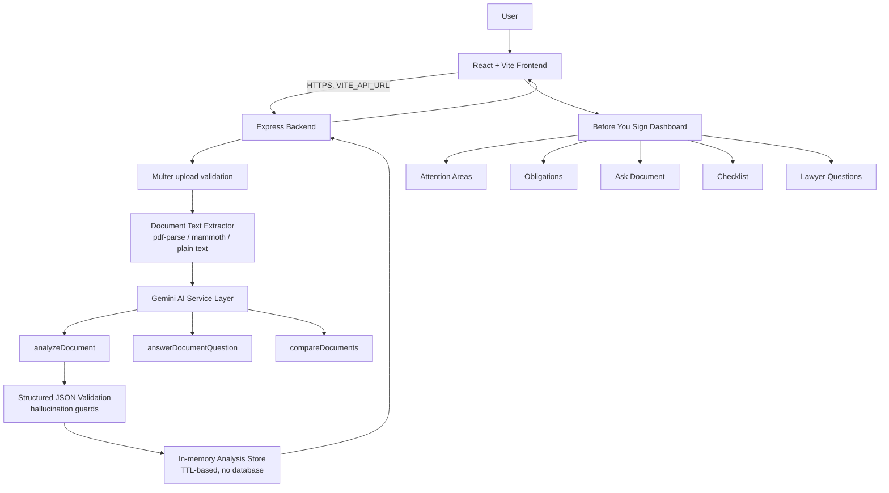

# LexiLens AI

**Before you sign, know what you're agreeing to.**

LexiLens AI is a GenAI-powered "before you sign" companion that helps ordinary people understand legal documents — employment contracts, rental agreements, freelance agreements, NDAs, service agreements, and similar documents — before they sign them. It is not a lawyer, and it does not give legal advice.

Built for the **PromptWars Virtual** hackathon, challenge: *AI for Legal Assistance & Access*.

---

## Problem

Legal documents are often dense and hard to parse for non-lawyers. People routinely sign documents without noticing important obligations, financial commitments, termination conditions, automatic renewals, penalties, liability limits, confidentiality requirements, non-compete restrictions, IP clauses, or dispute-resolution terms — until those terms matter.

## Solution

LexiLens AI proactively surfaces what deserves attention in a document, instead of waiting for the user to know what to ask. The core experience is a **Before You Sign** dashboard that:

- Flags clauses by attention level (High / Medium / Low) — never framed as a "legal risk score" or a legal verdict
- Shows every finding's original clause text as evidence, so nothing is invented
- Explains each clause in plain language, alongside why it may matter and what to check
- Separates "your obligations" from "the other party's obligations"
- Lets you ask the document direct questions, answered only from its actual text
- Generates a "before you sign" checklist and a list of questions to bring to a lawyer
- Compares two versions of a document to show what changed

## Features

| Feature | Description |
|---|---|
| Before You Sign dashboard | The primary, proactive analysis view — not a chatbot waiting for questions |
| Evidence-first analysis | Every finding cites the original clause text from the document |
| Plain language toggle | Switch between original wording and a beginner-friendly explanation |
| Obligation extraction | Separates the user's obligations from the other party's |
| Document Q&A | Grounded answers with source citations; refuses to answer what isn't in the document |
| Document comparison | Diffs two contract versions (Added / Removed / Modified) |
| Action checklist | Auto-generated, exportable "before you sign" checklist |
| Lawyer question generator | Auto-generated questions for a legal professional, derived from findings |

## Architecture



Checklist and lawyer-question generation are derived deterministically from the already-completed analysis (no extra AI calls), which keeps the app efficient and avoids duplicate AI usage per the project's performance requirements.

## Tech stack

- **Frontend:** React 18, Vite, Tailwind CSS, React Router, Lucide React icons
- **Backend:** Node.js, Express
- **AI:** Google Gemini API (`gemini-2.5-flash`), called **only** from the backend
- **Document parsing:** `pdf-parse` (PDF), `mammoth` (DOCX), native text handling (TXT)
- **No database** — an in-memory, TTL-expiring store holds analysis results just long enough for a session's Q&A/checklist calls to reuse them

## GenAI integration

Gemini is called from these backend modules, each with its own focused prompt and system instruction (`backend/services/ai/`):

- `analyzeDocument.js` — `analyzeDocument()`: single structured call producing summary, document type, parties, important dates, attention areas, and obligations together (to avoid multiple redundant AI calls per document)
- `answerDocumentQuestion.js` — `answerDocumentQuestion()`: grounded Q&A, refuses to answer beyond the document's text
- `compareDocuments.js` — `compareDocuments()`: structural diff between two documents
- `generateChecklist.js` — `generateChecklist()` / `generateLawyerQuestions()`: derived from the analysis above without further AI calls

Every AI call:
- Uses a strict system instruction forbidding invented clauses, laws, dates, or legal conclusions
- Requires a `responseMimeType: application/json` structured response, which is then validated server-side
- Falls back to `"Not specified in the provided document."` (analysis) or `"I couldn't find this information in the provided document."` (Q&A) when information is absent, rather than guessing

## Security

- API key (`GEMINI_API_KEY`) lives only in the backend `.env`; it is never sent to or referenced by the frontend
- File uploads validated by both MIME type and extension; oversized files (>10MB) rejected by Multer limits
- Uploaded files are handled entirely **in memory** (Multer memory storage) — nothing is written to disk, so there is nothing to clean up or leak
- Rate limiting: 60 req/min general, 12 req/min on AI-calling routes, per IP
- CORS restricted to the configured `FRONTEND_URL`
- All errors pass through a central handler that returns safe, generic messages — raw error messages and stack traces are never sent to the client, and document content is never logged
- `npm audit --production` reports **0 vulnerabilities** in both `frontend` and `backend`

## Privacy

Your document is processed for analysis and should be treated as sensitive information. Uploaded files are processed in memory and are not permanently stored; the extracted text is kept only briefly (in-memory, TTL-expiring) so you can ask follow-up questions in the same session, and is not written to any database. Avoid uploading documents containing information you are not authorized to share. This is **not** a claim that your data is "100% secure" — no system can promise that.

## Accessibility

- Semantic HTML, labeled form controls, and visible focus rings throughout
- Attention levels always shown with an icon **and** text, never color alone
- Keyboard-operable upload zone, tabs, and accordions
- Modal dialogs trap focus, close on Escape, and restore focus on close
- A skip-to-content link for keyboard users
- Respects `prefers-reduced-motion`

## Testing

See [`TESTING.md`](./TESTING.md) for the full list of automated tests and manual test cases.

```bash
cd backend && npm test   # 18 tests: extraction, validation, hallucination guards, caching, Q&A input validation
cd frontend && npm test  # component tests: attention badges, upload validation
```

## Installation

```bash
git clone <your-repo-url>
cd lexilens-ai

cd backend
npm install
cp .env.example .env   # then fill in GEMINI_API_KEY

cd ../frontend
npm install
cp .env.example .env   # defaults to http://localhost:5000, fine for local dev
```

## Environment variables

**`backend/.env`**
```
GEMINI_API_KEY=your_key_here
PORT=5000
FRONTEND_URL=http://localhost:5173
```

**`frontend/.env`**
```
VITE_API_URL=http://localhost:5000
```

## Running locally

```bash
# Terminal 1
cd backend
npm run dev

# Terminal 2
cd frontend
npm run dev
```

Visit `http://localhost:5173`.

## Deployment

- **Frontend → Vercel:** set the project root to `frontend/`, build command `npm run build`, output directory `dist`. Add environment variable `VITE_API_URL` pointing at your deployed backend.
- **Backend → Render:** set the root to `backend/`, build command `npm install`, start command `npm start`. Add environment variables `GEMINI_API_KEY`, `PORT` (Render sets this automatically — Express already reads `process.env.PORT`), and `FRONTEND_URL` set to your deployed Vercel URL.

The backend's CORS configuration reads `FRONTEND_URL` at runtime, and the frontend reads `VITE_API_URL` at build time — neither hardcodes `localhost` in production.

## Project structure

```
lexilens-ai/
├── frontend/
│   └── src/
│       ├── components/       # Reusable UI (Navbar, UploadZone, Modal, dashboard/*)
│       ├── pages/             # Landing, Analyze, Dashboard, Compare, About
│       ├── services/api.js    # Single point of contact with the backend
│       ├── hooks/useAnalysis.jsx  # Frontend cache of the current analysis
│       └── utils/
├── backend/
│   ├── routes/                # analyze, qa, compare, checklist
│   ├── controllers/
│   ├── services/
│   │   ├── ai/                # analyzeDocument, answerDocumentQuestion, compareDocuments, generateChecklist, geminiClient
│   │   ├── documentExtractor.js
│   │   └── analysisStore.js   # in-memory, TTL-based cache
│   ├── middleware/             # upload validation, rate limiting, error handling
│   └── tests/
├── sample-data/                # Two contract versions for the /compare demo
├── TESTING.md
└── README.md
```

## Limitations

- AI-generated analysis may be incomplete or occasionally miss nuance in unusually phrased clauses
- Scanned/image-only PDFs without extractable text cannot currently be analyzed (no OCR)
- Very long documents are truncated to a bounded length before analysis
- Analysis and cached document text expire after 30 minutes of inactivity (in-memory store, no persistence)

## Future improvements

- OCR support for scanned documents
- Multi-document (3+) comparison
- Exportable PDF report of the full Before You Sign analysis
- Persistent, authenticated accounts with encrypted document history (would require a database and explicit consent flows)

## Legal disclaimer

LexiLens AI provides educational and informational assistance and is not a substitute for professional legal advice. AI-generated analysis may be incomplete or inaccurate. Consult a qualified legal professional for advice about your specific situation.
